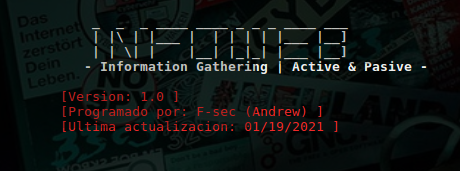
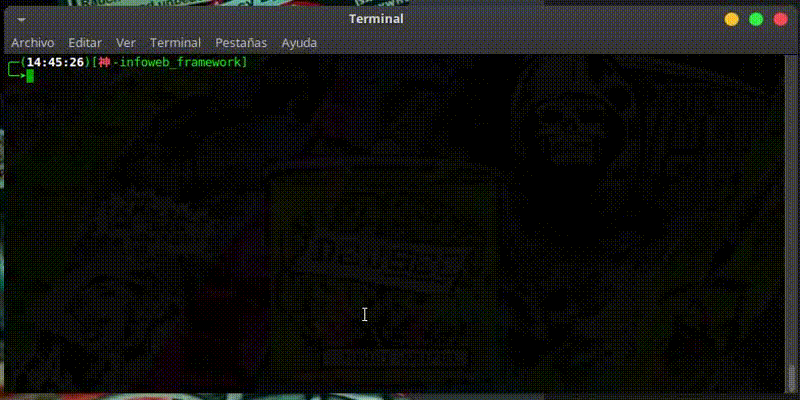

# infoweb_framework

  

Version interactiva de mi anterior herramienta infoweb, con mas funciones y muy util en escenarios reales.
infoweb_framework nos brinda estas funciones:

- **Ver encabezado del servidor Web (header)**
- **Ver el fichero robots.txt**
- **Ver geolocalizacion del servidor**
- **Obtener las urls del servidor**
- **Ver directorios interesantes del servidor**
- **Obtener direcciones Emails**
- **Obteniendo subdominios y verificando si estan Online**

## Instalacion de modulos
``
python3 -m pip install requests
``
``
python3 -m pip install beautifulsoup4
``
## Demo:

